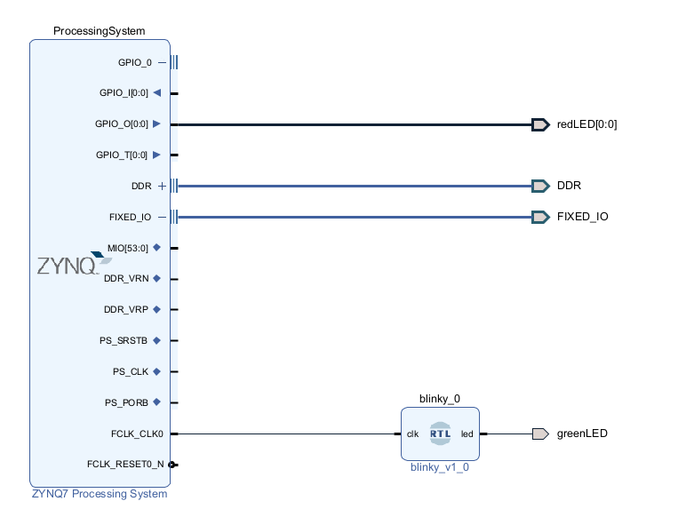
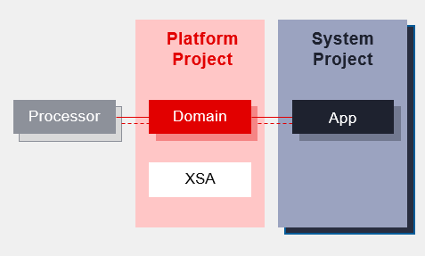

# Blinky Project

The objective of this project is to start using Zynq's PS, the system developed is to instantiate the PS (ZYNQ7 Processing System) configured with Vitis with a blinky.

Furthermore, a blinky was developed in RTL that uses the PS clock for its operation.

This way, in the end we have two working LEDs, one being controlled by the PS and the other by the PL.

We are using EMIO 0 to acess the Led (led is connected at PL)

---
# Vitis Workflow

1 - Platform Project: 
    - Provides hardware information and software environment setting
    - Domain: provides runtime for applications, such as operating system or BSP

2 - System Project:
    - Contains one or more applications that run at the same time