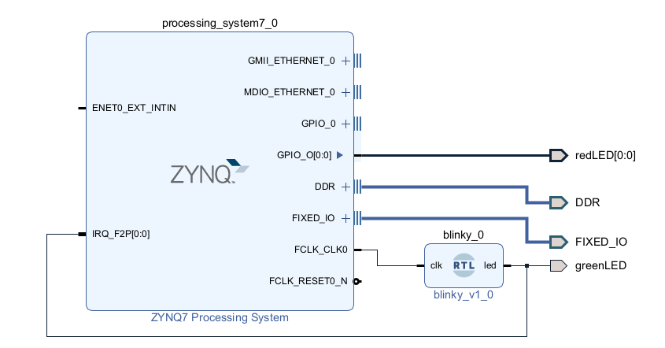

# Interrupt Project

The objective of this project is to measure the time it takes for the SoC to process an interrupt.

In this example, the PL has a blinky that feeds the IRQ input of the PS, and we also externalized it on the greenLed pin. The PS's C code was developed so that on the rising edge of a pulse at the IRQ input, an EMIO (connected to the redLED) performs a toggle.

The time was measured using an oscilloscope. The blue waveform corresponds to the greenLed pin, and the orange waveform corresponds to the redLED pin

